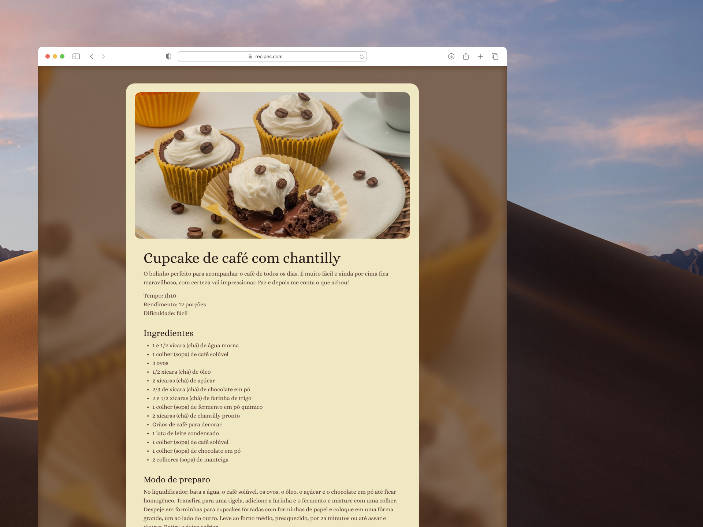

# Recipe Page




## 📝 About the project

This project consists of a website that displays a recipe page. The page contains the recipe name, ingredients, and preparation steps. The project was developed for the purpose of studying HTML and CSS.

## 👩🏻‍💻 Technologies

This project uses the following technologies:

- HTML
- CSS

## 👀 Live Preview

You can see the project live at the following link: [Recipe Page](https://amanda-santos.github.io/recipe-page/)

## 💻 Prerequisites

Before you begin, make sure you meet the following requirements:

- You have a Windows / Linux / Mac machine;
- You have Git installed and configured.

## ⚙️ Installing `recipe-page`

To install `recipe-page`, follow the steps below:

Clone the repository `recipe-page`

```bash
git clone git@github.com:amanda-santos/recipe-page.git
```

You are ready to go!

## 🚀 Using `recipe-page`

To use `recipe-page`, follow these steps:

Open the `index.html` file in your browser or use a local server (for example, with the Visual Studio Code extension [Live Server](https://marketplace.visualstudio.com/items?itemName=ritwickdey.LiveServer)).

## 📫 Contributing to `recipe-page`

Here's how to contribute to `recipe-page`:

1. Fork this repository.
2. Create a branch: `git checkout -b <branch_name>`.
3. Make your changes and commit them: `git commit -m '<commit_message>'`
4. Push to the original branch: `git push origin recipe-page / <location>`
5. Create the pull request.

Alternatively, see the GitHub documentation on [how to create a pull request](https://help.github.com/en/github/collaborating-with-issues-and-pull-requests/creating-a-pull-request).

## 🤝 Contributors

We thank the following people who contributed to this project:

<table>
  <tr>
    <td align="center">
      <a href="#" title="set the link title">
        <br>
        <sub>
          <b>Amanda Santos</b>
        </sub>
      </a>
    </td>
  </tr>
</table>

## 📝 License

This project is licensed. See the [LICENSE](LICENSE.md) file for more details.
